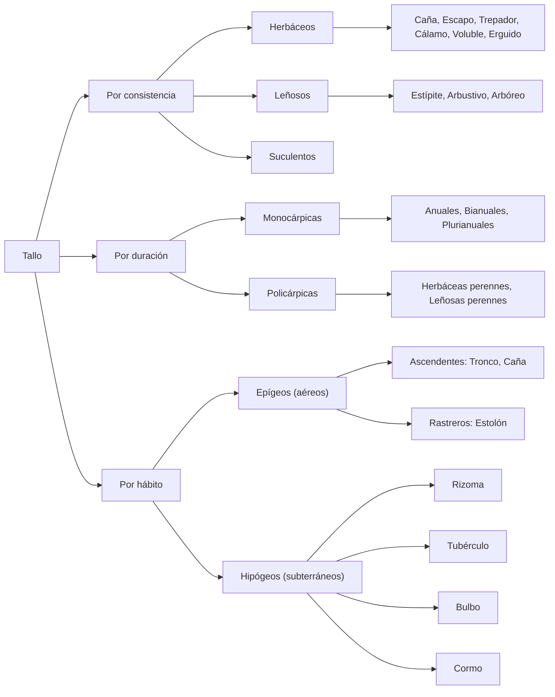
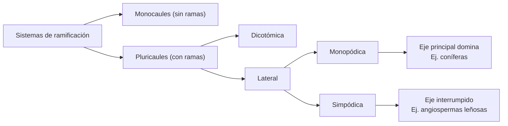
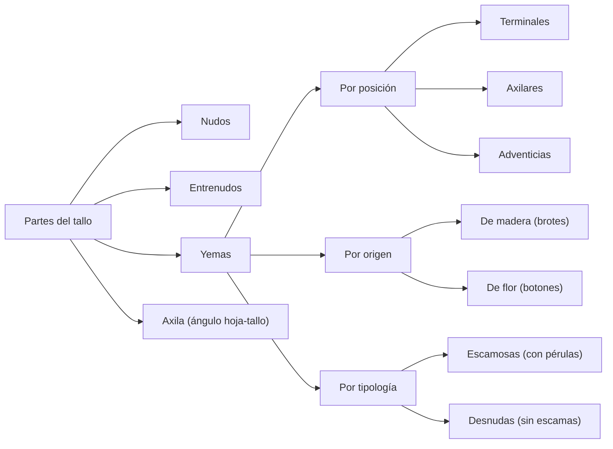
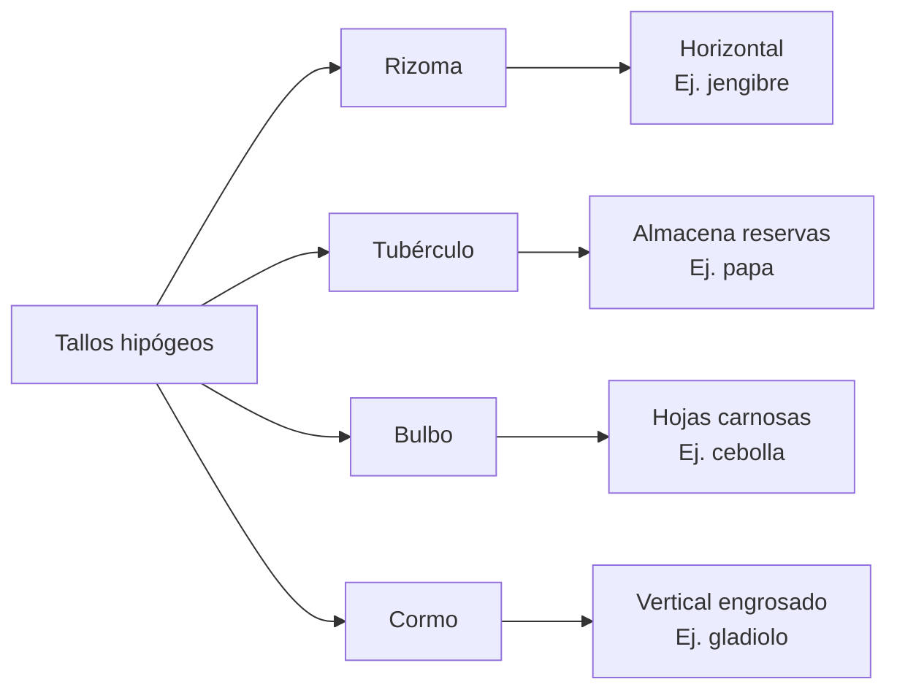

# 1. Introducción

El cuerpo de las plantas vasculares (Espermatofitas o Fanerógamas), de acuerdo con Holman (1961) e Ingrouille (1992), está compuesto por dos partes distintas que se desarrollan en ambientes diferentes: una parte subterránea y otra parte aérea. 

- Parte subterránea: Absorbe los nutrientes y el agua del suelo y, además, lo mantiene fijo en el suelo. Está compuesto por la raíz.

- Parte aérea (brote o vástago). Soporta a las ramas, hojas, flores y frutos, conduce tanto la savia bruta como la elaborada; en ocasiones, realiza fotosíntesis; actúa como órgano de reserva acumulando sustancias elaboradas o simplemente agua. Está compuesto por el tallo y las hojas.

El cormo, es el cuerpo vegetativo pluricelular de las plantas superiores terrestres e incluye tanto a la parte subterránea y aérea. 

## 1.1. Concepto de tallo

El tallo (lat. *thallus* y gr. *thallos*, rama verde), según Cronquist (1997), es el órgano vegetal casi siempre cilíndrico, con simetría radiada y gravitropismo negativo y adelgazado hacia la punta. También, es portador de hojas (sean éstas verdes, reducidas a escamas o cicatrices foliares) así como de estructuras derivadas de éstas (flores y frutos). Otra característica es su color verde, incoloro; puede presentar un porte erecto, rastrero o trepador. 

## 1.2. Origen del tallo

El embrión o semilla contiene, la radícula, en un extremo, de la que se desarrollará todo el sistema radical del vegetal adulto. Del otro, contiene la plúmula, un tallo rudimentario que formará el tallo y los demás órganos aéreos. La plúmula es una estructura cilíndrica y breve, en la porción superior del embrión (epicotilo), en cuyo ápice se encuentra el meristemo caulinar, protegido por pequeñas hojas (primordios). Tras la germinación, el meristemo apical caulinar va alargando el eje caulinar formando los nudos y los entrenudos.

# 2. Características

El tallo es verde o a veces incoloro, está dividido, presenta nudos o entrenudos y yemas y presenta hojas o brotes. Además, el tallo es de forma cónica, generalmente muy alargada y crece en dirección opuesta a la fuerza de gravedad (gravitropismo negativo) y hacia donde haya luz (fototropismo positivo). (Thomas-Doménech, 1997)

# 3. Funciones

Entre las funciones del tallo, que pueden agruparse en primarias y secundarias, se encuentran:

- La producción y soporte de órganos aéreos laterales, como las hojas y foliolos, en fase vegetativa, y flores o inflorescencias, fase reproductiva. Además, los órganos derivados como frutos y semillas.

- La distribución de las hojas (filotaxia) de tal manera que puedan absorber libremente de la atmósfera los gases esenciales y recibir gran cantidad de energía radiante solar. 

- La vía de circulación de nutrientes y solutos entre raíces y hojas.

El tallo, Valla (1979), puede presentar modificaciones que le permitan realizar, hasta cierto punto, algunas funciones secundarias, entre ellas:

- Fotosíntesis. En las plantas sin hojas, mientras se mantienen verdes. Por ejemplo, las cactáceas presentan tallos suculentos fotosintéticos (cladodios o tallos columnares).
- Reserva de sustancias de reserva y agua.
- La respiración vegetal.
- La reproducción.

## 3.1. Usos

Los tallos pueden ser utilizados como alimento humano (espárrago, palmito, etc.) o forraje animal. Los tallos gruesos aún verdes son secados para usarlos como forraje. Otros usos son como materia prima en la industria alimentaria (caña de azúcar), textil (lino), maderera (pino, roble, ébano), etc., así como en la construcción, la carpintería y la ebanistería. 

# 4. Partes del tallo

## Partes del tallo (Texto corregido)

- Los **nudos** son las salientes donde las hojas se unen o se insertan al tallo. En árboles caducifolios, los nudos quedan marcados por las cicatrices foliares.

- Los **entrenudos** o **internodios** están comprendidos entre dos nudos consecutivos.

- Las **yemas** son los abultamientos que, al desarrollarse, originan hojas, flores o ramificaciones del tallo. Se ubican en la axila de cada hoja y en el ápice del tallo.

La axila es el ángulo formado por la hoja (o su pecíolo) y el entrenudo del tallo que la sostiene; normalmente contiene una yema axilar capaz de desarrollarse. En hojas altamente modificadas, muy reducidas o inconspicuas, la yema axilar suele ser evidente. El pecíolo es el apéndice foliar por el cual la hoja se une al tallo.

# 5. Sistemas de ramificación

Las características del eje principal y de los distintos tipos de vástagos y la disposición espacio temporal de los mismos, según Serebryakova (1969), Mühlberg (1966, 1970), Rua & Weberling (1995), define la forma de crecimiento de cada especie.

## 5.1. Plantas monocaules

Son aquellas plantas cuyo vástago no presenta ningún tipo de ramificación, excepto en la inflorescencia. Ej.: Maíz, azucena, etc. 

## 5.2. Plantas pluricaules

Las plantas pluricaules son las plantas cuyo vástago se ramifica. Estas plantas se vuelven a subdividir en ramificación dicotómica y lateral.

### 5.2.1. Ramificación dicotómica

El ápice se divide en dos por división de la célula apical. En otros casos, el ápice cesa de crecer. En la periferia se diferencian en dos células apicales y cada una origina un nuevo ápice.

### 5.2.2. Ramificación lateral

Las ramas se originan en yemas axilares, a partir de la 2da. o 3ra. hoja desde el ápice. En Pteridófitas, la ramificación suele producirse a partir de yemas ubicadas en los rizomas o en las axilas de las hojas basales; excepcionalmente, en ciertos grupos, se forman yemas adventicias (bulbilos) sobre la cara abaxial de las hojas o sobre el pecíolo. En algunas especies con rizomas dorsiventrales, las yemas surgen sin relación directa con las hojas (ramificación acrógena). Este tipo de ramificación lateral es el dominante en espermatófitas.

- La ramificación **monopódica** es un tipo de ramificación indefinida de forma cónica, debido a la dominancia apical (inhibición del desarrollo de las yemas laterales ejercida por las auxinas producidas en la yema terminal), lo que se traduce en una marcada acrotonia (mayor vigor de las yemas superiores frente a las inferiores). Así, el eje principal único o monopódico crece más intensamente que los ejes laterales de primer orden, y éstos a su vez más intensamente que los de segundo orden, y así sucesivamente. Es frecuente en coníferas, cuyo ápice del tallo o yema terminal permanece perennemente joven y se sitúa con los años cada vez más alto; mientras tanto, las ramas originadas por las yemas laterales nacen a su alrededor, siendo más largas las inferiores y más cortas a medida que se disponen hacia arriba.

- En la ramificación **simpódica**, las ramas laterales se desarrollan más que el eje principal pudiendo, incluso, interrumpir completamente su crecimiento, sea porque queda en reposo o sea porque se transforme en una flor o muera. Así, una o más yemas axilares, generalmente las superiores, continúan el crecimiento y prosiguen su ramificación.

# 6. Tipos de tallos

La forma del tallo (alto, ancho, consistencia, grado de ramificación, etc.) se denomina porte y su aspecto final depende de la interacción de la información genética de la planta con el medio ambiente.

## 6.1. Por su consistencia

### 6.1.1. Herbáceos

Los tallos herbáceos poseen tejidos poco lignificados y, por lo general, no presentan crecimiento secundario en grosor (ausencia de cámbium vascular activo); sin embargo, pueden desarrollar esclerénquima (fibras y esclereidas) para brindar soporte mecánico, como ocurre en gramíneas y en muchas dicotiledóneas herbáceas. Tienen consistencia suave y frágil y color verde. Ej.: Albahaca, cebada, gramíneas, poroto, etc.

- **Caña:** Tallo herbáceo de estructura cilíndrica, compuesto por una sucesión de nudos y entrenudos, los cuales pueden presentar un interior hueco. En gramíneas, el macollaje es un tipo de ramificación basal, que surge de los nudos inferiores cercanos al suelo. Normalmente, está compuesta por hojas acaules. Ej.: Avena (*Avena sativa*), maíz (*Zea mays*), trigo (*Triticum aestivum*).

- **Escapo:** Tallo sin hojas cuya función es sostener el sistema reproductivo (flores y luego frutos). Es característico en monocotiledóneas. Cuando acaba su función se seca y cae. Ej.: Lechuga.

- **Trepadores:** Tallos que poseen estructuras especializadas como zarcillos para su sujeción y ascenso sobre soportes.

- **Cálamos:** Tallos aéreos, de sección cilíndrica, sin nudos marcados externamente. Ej.: Junco (*Juncus* sp.).

- **Volubles:** Tallos flexibles y que se pueden enrollar, para sujeción de la planta. Ej.: Poroto (*Phaseolus vulgaris*), batata (*Ipomoea batatas*) o vainilla (*Vanilla planifolia*).

- **Erguido:** Tallos con crecimiento vertical predominante. Ej.: Albahaca, algodón, girasol, repollo, soja, tártago.

### 6.1.2. Leñosos

Los tallos leñosos desarrollan tejido adulto (esclerénquima) y presentan crecimiento secundario en grosor gracias a la actividad del cámbium vascular, lo que produce xilema secundario (madera) y floema secundario. Son rígidos y duros. Si bien la mayor parte del tejido adulto está lignificado y la corteza externa (súber) suele carecer de clorofila, muchos tallos leñosos jóvenes (ramas del año, brotes epicórmicos o especies con corteza lisa) presentan clorofila en tejidos subepidérmicos (felodermis) y realizan fotosíntesis caulinar. Por lo tanto, no es correcto afirmar que carecen totalmente de clorofila ni que, por ese motivo, nunca son verdes. Ej.: Ceibo, mango, palmera, pino, roble, etc.

- **Estípite**: Aquel tallo en el cual la única yema que se desarrolla es la apical. Este tipo de tallos se encuentra en las palmeras.

- **Arbustivos**: Desarrollan tejido adulto, pero solo en la parte próxima a la base. La parte superior la componen tejidos jóvenes. La vid (*Vitis vinifera*) es una liana leñosa (arbusto trepador leñoso).

- **Arbóreo**: Estos tallos desarrollan tejido adulto al completo, excepto en las yemas apicales y axilares. Poseen súber (tejido muerto que protege a los otros tejidos internos).

### 6.1.3. Semileñosos, carnosos y suculentos

Tallos de consistencia intermedia, que pueden presentar lignificación parcial en la base y tejidos parenquimáticos muy desarrollados que almacenan agua. Ej.: *Kalanchoe* spp. (siempreviva), cactus (Cactaceae), euforbias suculentas y algunas crasuláceas (se excluye al geranio, que no es un tallo suculento típico).

## 6.2. Por su duración

### 6.2.1. Monocárpicas o hapaxánticas

Las plantas monocárpicas o hapaxánticas, según Michel Guédès (1979) y (Lindorf et al. (1991), son aquellas que presentan una estrategia de reproducción que se caracteriza por un único episodio de floración y reproducción antes de la muerte.

- Las plantas anuales desarrollan su ciclo vital (germinación, crecimiento, floración y fructificación) durante un año. Ej.: Avena, arveja, cebada, soja, tabaco, zapallo, zapallito.

- Las plantas bianuales completan su ciclo vital en dos (2) años, aproximadamente. Ej.: Cebolla, lechuga, remolacha, zanahoria. Durante el primer año acumulan sustancias de reserva, que son utilizadas durante el segundo año para producir semillas.
    
- Las plantas plurianuales son plantas que viven años antes de florecer y completar su ciclo vital. 
    

Las plantas hapaxánticas pueden ser monocaules o pluricaules. Muchas dicotiledóneas monocárpicas se ramifican (ramificación basítona) pero siempre son herbáceas, los tallos forman poco leño secundario y no tienen peridermis.

### 6.2.2. Policárpicas, perennes, pleonánticas, polacánticas

A continuación, se presenta el texto **corregido** para el apartado **6.2.2. Policárpicas, perennes, pleonánticas, polacánticas**, eliminando por completo la información correspondiente a plantas monocárpicas (que pertenece a 6.2.1) y ajustando la definición y los ejemplos para que sean botánicamente precisos.

---

## 6.2.2. Policárpicas, perennes, pleonánticas o polacánticas

Las plantas policárpicas (pleonánticas o polacánticas) florecen y fructifican repetidamente a lo largo de varios años o ciclos estacionales, sin que el episodio reproductivo cause la muerte del individuo. Cada floración constituye el final de un período de crecimiento, pero la planta conserva meristemas vegetativos que le permiten reiniciar su desarrollo en la temporada siguiente.

- **Policárpicas herbáceas** (perennes herbáceas): La parte aérea muere al final de cada ciclo estacional, generalmente durante el invierno o la estación seca. Sin embargo, los órganos subterráneos de reserva —como rizomas, bulbos, tubérculos, raíces tuberosas o sistemas de raíces adventicias— permanecen vivos y acumulan nutrientes. Al llegar la estación favorable, regeneran nuevos brotes aéreos. Ejemplos: pastos perennes (gramíneas forrajeras), lirio , peonía, menta y fresas.

- **Policárpicas leñosas** (perennes leñosas): La parte aérea no muere tras la floración; los tallos se lignifican y persisten durante varios años, soportando condiciones adversas (frío, sequía) mediante yemas durmientes que reanudan su crecimiento en la primavera o al inicio de las lluvias. Pueden presentar diversos portes:
  - Árboles: con un tronco principal leñoso y dominante.
  - Arbustos: con múltiples tallos leñosos que nacen desde la base, sin un tronco único diferenciado.
  - Subarbustos o matas: con base leñosa y ápices herbáceos que mueren parcialmente cada año.
  
Su sistema de ramificación puede ser monopodial (eje principal dominante, como en muchas coníferas) o simpodial (eje principal sustituido por ramas laterales, como en la mayoría de las angiospermas leñosas). Ejemplos: roble, pino, rosal, vid y olivo.

## 6.3. Por su hábito o situación

Pueden ser tallos aéreos o tallos subterráneos según se desarrollen sobre o bajo la superficie del suelo.

### 6.3.1. Tallos epígeos o aéreos

Crecen por encima de la tierra.

#### 6.3.1.1. Ascendentes

Los tallos ascendentes crecen verticalmente. Pueden ser:

- **Tronco**: Tallo aéreo, leñoso, ramificado y con un claro eje principal dominante que persiste durante toda la vida de la planta. Es característico de los árboles, los cuales presentan un único eje central (fuste) que se alarga y engrosa con el tiempo. Los arbustos, en cambio, carecen de un tronco único y diferenciado; se caracterizan por poseer múltiples tallos leñosos que emergen desde la base o a poca altura del suelo, formando macollas o matas (ej. laurel, romero, lilas).

- **Caña**: Tallo cilíndrico que tiene los nudos muy marcados en todo su alrededor. Algunas cañas son huecas (trigo) y otras macizas (maíz).

#### 6.3.1.2. Rastreros

Los tallos rastreros crecen horizontalmente, sobre el suelo.

- Estolón: Tallo rastrero que se desarrolla horizontalmente. Estos tallos, al hacer contacto con la tierra, emiten raíces adventicias y desarrollan una nueva planta (frutilla). La sandía es rastrero con zarcillos. El maní es decumbente y rastrero.
    

### 6.3.2. Tallos hipógeos o subterráneos

Crecen bajo tierra pero no son raíces. Pueden presentar catáfilos. 

- Rizoma: Tallo de longitud y grosor variable que crece horizontalmente bajo la superficie del suelo. Las yemas de este tallo subterráneo originan anualmente brotes que salen al exterior y se cubren de hojas. Ej.: Cálamo, lirio, jengibre.
    
- Tubérculo: Porción de tallo subterráneo que almacena sustancias nutritivas de reserva. Las yemas de estos tallos originan brotes que salen al exterior. Existen especies comestibles. Ej.: Papa.
    
- Bulbo: Tallo muy corto y erecto convertido en órgano de reserva o almacenamiento. Posee raíces fibrosas en la parte inferior que transportan nutrientes pero sin almacenarlos. Presentan una yema terminal en la parte superior protegida por unas hojas carnosas (catáfilos) que almacenan sustancias de reserva y recubren el ápice y lo protegen. Tienen yemas o brotes que producen tallos aéreos y hojas. Ej.: Ajo (Allium sativum), cebolla (Allium cepa), puerro (Allium ampeloprasum).
    

- Bulbos tunicados: Las hojas forman varias capas concéntricas, recubiertas entre sí completamente. Son la parte nutritiva. Las interiores son gruesas y carnosas y, las exteriores, delgadas y fibrosas, como el papel.
    
- Bulbos escamosos: Las hojas (la parte nutritiva) tienen forma de escama y están imbricados, o sea, sólo se superponen en parte, como las tejas en un tejado.
    
- Bulbos macizos: Tienen el platillo dilatado y carnoso, que ocupa casi todo el bulbo con sustancias nutritivas. Están envueltos en laminillas envolventes, delgadas y secas.
    

- Cormo: Los cormos son de tallos engrosados subterráneos, de base hinchada y crecimiento vertical que contiene nudos y abultamientos de los que salen yemas. Está recubierto por capas de hojas secas, a modo de túnicas superpuestas. En la parte inferior produce pequeños cormos nuevos que servirán para la reproducción de nuevas plantas. Se asemejan a los bulbos, por acumular sustancias nutritivas, sin embargo, los cormos no poseen capas. Las plantas que presentan cormos son plantas perennes que pierden sus partes aéreas en climas fríos durante la época invernal, conservando únicamente su parte subterránea. Esta capacidad para almacenar nutrientes constituye un método de supervivencia en caso de condiciones adversas, como una prolongada sequía o una temporada estival demasiado calurosa.
    

# 7. Yemas

## 7.1. Morfología y disposición

Las yemas son las estructuras encargadas del crecimiento del tallo. Además, producen hojas y ramificaciones. Una yema es el extremo joven de un vástago, y por lo tanto además del meristema apical, lleva hojas inmaduras o primordios foliares.

La yema situada en el extremo del eje es la yema terminal. Las que se encuentran en la unión de las hojas con el tallo son las yemas axilares.

Órgano más o menos puntiagudo o redondeado cubierto de escamas. Cuando la yema se  
desarrolla da lugar al tallo o a una flor.

En las plantas anuales, se desarrollan desde el momento de su formación. En las plantas perennes, las yemas se desarrollan durante el verano, permanecen en estado durmiente durante el invierno y, por lo general se desarrollan en la primavera siguiente para convertirse en brotes o flores.

Las yemas que originan tallos leñosos, al desarrollarse en la primavera dan lugar a una formación herbácea llamada brote, provisto de hojas y nuevas yemas. Al finalizar el otoño se lignifica y pasa a llamarse ramo. En la primavera siguiente, las yemas del ramo se desarrollan formando nuevos brotes. El ramo adquiere mayor grosor y pasa a llamarse rama.

- Las ramas primarias o madres son aquellas que salen del tronco.
    
- Las ramas secundarias son aquellas que salen otras ramas más pequeñas y así sucesivamente.
    

## 7.2. Clasificación

### 7.2.1. Por su posición en el tallo

- Terminales: Ubicadas en el extremo o meristemo apical de un brote.

- Axilares o laterales: Ubicadas en las axilas de las hojas.

- Adventicias: Se forman a partir de tejidos que normalmente no son meristemáticos, como raíces, tallos viejos (madera), hojas o incluso tejidos cicatriciales próximos a heridas. Su inducción está regulada por estímulos hormonales (principalmente citoquininas) y procesos de desdiferenciación celular. Estas yemas permiten la regeneración de la planta tras podas, daños mecánicos o condiciones de estrés, y son ampliamente aprovechadas en propagación vegetativa (esquejes, acodos, etc.).

### 7.2.2. Por lo que originan

▪ Yema de madera: Originan brotes. Son puntiagudas y pequeñas.

▪ Yemas de flor o botones: Originan una o más flores. Son redondeadas y de mayor tamaño.

## 7.3. Tipología

### 7.3.1. Yemas escamosas

En estas, el ápice vegetativo está protegido por hojas modificadas con aspecto escamoso, dispuestas apretadamente. Generalmente estas escamas, pérulas o tegumentos son oscuras y coriáceas, cumplen el rol de protección del ápice vegetativo.

Las escamas, estrechamente aplicadas unas sobre otras y provistas de una gruesa cutícula, impiden la desecación de los tejidos embrionales durante el invierno, cuando la circulación de la savia es más lenta.

En primavera, las escamas caen y los tejidos apicales reinician su actividad y los primordios foliares se desarrollan en hojas adultas. Se encuentran con frecuencia en especies tropicales siempreverdes y también en especies deciduas.

Si se hace un corte longitudinal de la yema, se observa, por debajo de las escamas protectoras, el ápice vegetativo, y los primordios foliares.

### 7.3.2. Yemas desnudas

Están desprovistas de escamas protectoras y en este caso, el ápice generalmente sólo está protegido por hojas jóvenes. Estas yemas se presentan generalmente en vegetales herbáceos. En ciertos casos es difícil distinguir las yemas del resto del tallo, especialmente cuando los primordios no están claramente agrupados, como sucede en grandes monocotiledóneas.

![[Tallo clasificación.canvas]]
## Gráficos
## Clasificación general del tallo

*Nota*: Elaboración propia (2026). El esquema sintetiza la clasificación general del tallo según sus tres criterios principales: consistencia (tejidos), duración (ciclo de vida) y hábito (ubicación respecto al suelo).

## Sistemas de ramificación

*Nota*: Elaboración propia (2026). El esquema diferencia entre plantas monocaules (que no ramifican, como el maíz) y pluricaules (que sí ramifican). A su vez, subdivide la ramificación lateral en monopódica (eje principal dominante, típico de coníferas) y simpódica (eje interrumpido por ramas laterales, común en angiospermas leñosas), lo cual es clave para entender la arquitectura y la forma de crecimiento de cada especie.

## Partes del tallo y tipos de yemas

*Nota*: Elaboración propia (2026). El esquema desglosa las partes estructurales del tallo (nudos, entrenudos, axila y pecíolo) y profundiza en la clasificación de las yemas según tres criterios: posición, origen y tipología.

## Tallos subterráneos

*Nota*: Elaboración propia (2026). El esquema compara los tipos de tallos subterráneos: rizoma (crecimiento horizontal), tubérculo (almacena reservas), bulbo (con hojas carnosas o catáfilos) y cormo (tallo engrosado vertical con túnicas)